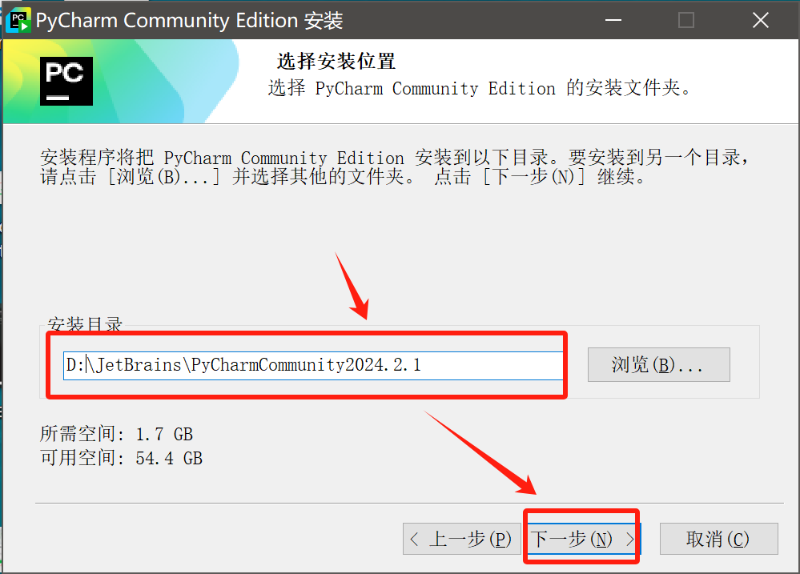
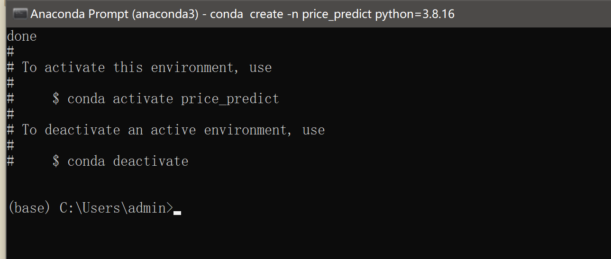
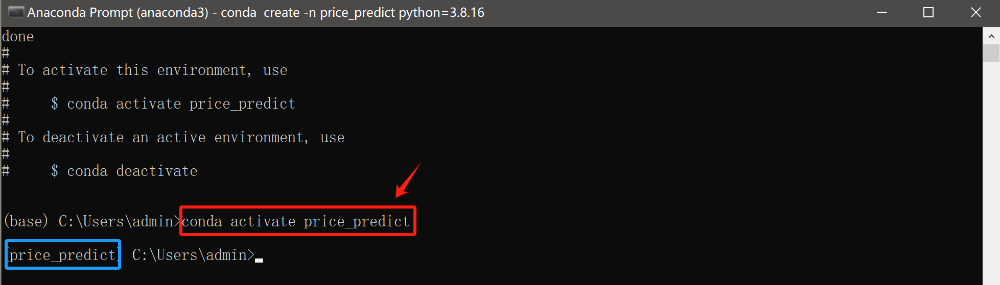

<!-- # Anaconda3+PyCharm环境配置 -->
# 前言
Python编程语言具备开放的社区环境和丰富多样的第三方库支持，不同的项目可能需要不同版本的第三方库和包，直接在系统级别安装库可能导致库之间的依赖冲突。因此，进行Python项目开发时我们需要合适的开发环境和第三方库管理工具，确保不同项目都可以有一个干净、隔离的开发环境。同时，Python是一种解释型语言，代码在运行时逐行执行，这使得调试和追踪错误尤为重要。

在Python项目开发中，很多人会**使用Anaconda来管理环境和包**，而**用PyCharm来编写和调试代码**，这样可以结合两者的优势，显著提高开发效率。

以**Windows10**操作系统为例，我们介绍如何安装配置Anaconda和PyCharm软件，并在此配置环境下运行python项目。
## Anaconda
### 什么是Anaconda
Anaconda 是一个开源的Python和R语言的发行版，主要用于科学计算和数据科学。它包括了Python解释器、许多科学计算和数据科学的库（如NumPy、Pandas、Matplotlib、SciPy等），以及包管理器Conda。

### Anaconda的优点
- 包管理和环境管理：Conda让你可以轻松管理不同的包和虚拟环境，不同的项目可以使用不同版本的Python和库，避免依赖冲突。
- 丰富的内置库：Anaconda自带许多常用的库，可以让你快速开始数据科学和机器学习的工作，而无需单独安装这些库。
- Jupyter Notebook支持：Anaconda包括Jupyter Notebook，这是一个非常流行的工具，特别适合数据分析和可视化。

## PyCharm
### 什么是PyCharm
PyCharm 是由JetBrains公司开发的一款Python集成开发环境（IDE），它提供了专业的代码编辑和调试工具。

### PyCharm的优点
- 智能代码编辑：PyCharm提供了强大的代码补全、语法检查和代码重构功能，可以极大提高开发效率。
- 调试工具：内置的调试器可以帮助你逐步执行代码，查看变量状态，发现和修复错误。
- 集成的版本控制系统：PyCharm支持Git、SVN等版本控制系统，让你更方便地管理项目代码。
- 插件扩展：PyCharm有大量插件，可以扩展IDE的功能，比如支持其他语言、工具集成等。
- 跨平台支持：可在 Windows、Linux 和 macOS 上运行。

## PyCharm中也有venv虚拟环境，为何不用？
通过PyCharm直接创建的虚拟环境（venv）和使用Anaconda创建的环境（env）之间存在一些关键的区别，这些区别源自于它们的底层管理方式、包管理系统和使用场景。

### 虚拟环境的基础
- PyCharm创建的venv：使用Python的内置模块venv来创建虚拟环境。这是一种轻量级的虚拟环境，它使用系统安装的Python解释器，并在项目目录中创建一个独立的环境，用于安装和管理项目的依赖包。
- Anaconda创建的env：使用Conda来创建虚拟环境。Conda不仅可以创建基于Python的环境，还可以创建包含其他语言（如R、Java等）的环境。Conda环境通常是通过Anaconda或Miniconda安装，并且包含了Conda的包管理功能。
### 包管理
- venv（PyCharm）：
    - 使用Python的pip来安装和管理包。
    - pip从Python Package Index (PyPI) 中下载和安装包，主要管理Python生态系统中的包。
    - 由于venv是Python内置的工具，适合那些不依赖Conda生态系统的用户。
- Conda（Anaconda）：
    - 使用Conda作为包管理器。Conda可以管理Python包，也可以管理其他语言的包，提供了更广泛的支持。
    - Conda从Anaconda仓库、Conda Forge等渠道下载包，能够更好地处理非Python依赖（如C库等），并且通常可以更容易地解决依赖冲突问题。
    - 适合科学计算、数据分析等需要使用大量依赖库的领域。
### 可移植性与灵活性
- venv（PyCharm）：
    - venv 创建的虚拟环境更接近于标准Python环境，适用于一般的Python项目开发。
    - 虚拟环境较轻量，依赖纯粹Python环境，迁移性较强，适合在不同的系统之间迁移项目。
- Conda（Anaconda）：
    - Conda环境具有更好的可移植性，尤其在科学计算、数据科学项目中，因为它可以处理非Python的二进制包。
    - Conda环境可以方便地管理和切换多个环境，不仅限于Python，还支持多语言开发。
### 内置工具和库
- venv（PyCharm）：
    - 通过venv创建的环境是精简的，除了Python标准库和基本的pip工具外，不会附带其他的库或工具。
- Conda（Anaconda）：
    - Anaconda提供的环境通常会预装大量的科学计算和数据科学相关的库（如NumPy、Pandas、SciPy等），以及Jupyter Notebook等工具。
    - 适合那些希望立即开始使用数据科学工具的用户，减少了初始配置的时间。
### 资源占用
- venv（PyCharm）：
    - 由于venv只是一个轻量级的虚拟环境，相对来说占用的磁盘空间和资源较少。
- Conda（Anaconda）：
    - Conda环境一般会附带更多的工具和包，特别是Anaconda完整发行版会占用更多的磁盘空间和资源。
### 总结
如果你主要进行一般的Python开发工作，且只需要Python相关的包管理，那么使用PyCharm的venv就足够了，它简单、轻量，并且集成在PyCharm中使用非常方便。

如果你从事科学计算、数据科学，或需要管理多种语言的环境和包，Anaconda的Conda环境可能更合适。它不仅可以管理Python包，还可以处理复杂的依赖关系，提供丰富的工具和库，适合需要更多包管理功能的开发者。

# 软件安装
## 安装Anaconda3
### 下载Anaconda installer
进入[Anaconda官网](https://www.anaconda.com/download/)下载适用于电脑操作系统的Anaconda安装包。 
 

### 安装Anaconda
1. 找到刚才下载的安装包，双击安装包文件，开始运行Anaconda安装程序。
 

2. 按照安装向导的指示进行安装。

    2.1. 点击“Next”开始安装。
     

    2.2. 同意用户须知。
     

    2.3. 选择“Just Me”选项，保证之后配置虚拟环境时在Anaconda安装目录下。
     

    2.4. 选择一个安装路径，最好安装在C盘之外的某个你喜欢的路径。
     

    2.5. 选择安装选项。
     

    2.6. 等待下载完成，然后点击若干次“Next”，最后点击“Finish”就安装完成了。
     

### 验证Anaconda是否安装成功
1. 在任务栏搜索框输入“anaconda”，找到“anaconda prompt”软件并打开，进入anaconda命令行操作界面。

2. 分别输入`conda -V`和`python -V`两条命令，如果都反馈显示版本号(版本号可以与下图显示不同)，即为安装成功。

## 安装PyCharm（免费的Community版本）
### 下载PyCharm installer
进入[PyCharm官网](https://www.jetbrains.com/pycharm/download)下载适用于电脑操作系统的PyCharm安装包。 （下滑找到免费的Community Edition）

### 安装PyCharm
双击运行刚才的PyCharm安装包文件，开始运行PyCharm安装程序，遵循安装向导指示开始安装。

1. 点击“下一步”开始安装。

2. 选择一个安装路径，最好安装在C盘之外的某个你喜欢的路径。

3. 选择安装选项，此处可以全选。

4. 选择开始菜单文件夹，保持默认文件夹即可，然后点击“安装”。

5. 等待安装完成，最后点击“完成”完成安装。

# 软件配置
## 使用anaconda创建和管理虚拟环境
这一章节介绍使用anaconda来创建、应用和管理虚拟环境的基本命令。使用时，打开“anaconda prompt”软件，进入anaconda命令行操作界面。

### 虚拟环境创建
1. 使用`conda create -n 环境名 python=3.8.16`命令创建一个虚拟环境，其中`环境名`替换成你为某个项目所用环境所用命名，便于区分不同python项目;`3.8.16`也可以替换为其他你所需要的python版本。

2. 输入`y`以进行下一步。

3. 完成环境初始化后，anaconda prompt页面显示如下。

### 进入、退出、查看和移除虚拟环境
- 使用`conda activate 要进入的虚拟环境名`命令进入某个已有的虚拟环境（然后命令行中也会显示出你当前使用的环境名称）。

- 使用`conda deactivate`命令可以退出当前虚拟环境。

- 使用`conda env list`命令可以查看已有虚拟环境的名称和位置路径。

- 使用`conda remove -n 要移除的虚拟环境名 --all`命令可以移除某个已有的虚拟环境。注意：**移除虚拟环境时最好先退出当前虚拟环境。并查看确认想要移除的虚拟环境名。**

### 配置虚拟环境下的第三方库
安装第三方库的时候需要**进入某个特定的虚拟环境**进行配置，配置环境的过程中可能遇到依赖冲突问题或报错，希望大家互相帮助并善用互联网资源寻求解决方案，多多尝试。

- 使用`pip install xxxx`命令可以安装第三方库，其中`xxxx`替换为你要安装的第三方库名称。
- 在已经有项目依赖项文件“requirements.txt”的情况下，可以直接使用`pip install -r requirements.txt`命令安装所需的第三方库。

## 配置PyCharm解释器（Interpreter）
这一章节介绍在PyCharm进行编程时，如何将合适的虚拟环境加入当前项目的编译配置。
### 新建一个Python项目并配置和运行
1. 打开PyCharm，在欢迎界面中点击“New Project”。

2. 为你的新建项目命名，勾选“Previously configured interpreter”，选择一个可用的解释器，可以通过点击右侧“...”在设备中查找。作为可选项，初次运行python项目时你可以勾选“Create a main.py welcome script”，Pycharm将在新建项目中展现一个示例Python脚本文件。

3. 在弹出的解释器添加窗口，左侧栏选中“Conda Environment”，点击下拉三角，在设备中查找所需解释器（python.exe文件）的路径并单击选中（这个.exe文件在之前配置的conda虚拟环境下，虚拟环境文件夹路径可以通过`conda env list`命令查看），然后点击“OK”完成配置。

4. 可以查看到特定虚拟环境下的python解释器已经配置完成，点击“Create”即可创建新的python项目。

5. 在PyCharm编辑界面，可以看到以下主要分区：

- 工具栏。提供了常用操作的快捷按钮，例如新建文件、打开文件、保存、运行代码、调试代码、版本控制等。你可以自定义工具栏中的按钮。
- 项目工具窗口。通常位于界面左侧，用于显示当前打开的项目结构和文件夹。你可以在这里浏览项目的文件和目录，进行文件的增删改操作。它是管理项目文件的主要区域。
- 编辑器窗口。位于界面中央，是代码编辑的主要区域。你可以同时打开多个文件，每个文件都会在编辑器顶部显示一个标签页。编辑器窗口支持多种语言的语法高亮、代码补全、错误提示等。
- 状态栏。位于界面底部，显示当前的项目信息，例如文件编码、当前Git分支、当前环境、运行状态等。它还显示了IDE的状态信息，比如是否有正在运行的进程。

6. 点击工具栏中绿色按钮，或者使用`Shift+F10`快捷键可以运行当前项目文件。运行代码后将自动出现运行窗口，通常位于底部工具窗口栏，显示程序的输出结果、日志信息，以及运行时的其他相关信息。

### 在已有Python项目中配置不同虚拟环境
如果已经打开了一个项目文件，但是需要选择、更换所使用的虚拟环境，你可以按照以下步骤进行配置。此处我们以“从OOD环境更换为price”

1. 打开PyCharm，进入“文件（File）->设置（Settings）”。

2. 在打开的设置窗口中依次打开“项目（Project）->Python解释器（Python Interpreter）->齿轮图标->添加（Add）”。

3. 在弹出的解释器添加窗口，左侧栏选中“Conda Environment”，右侧选中“Existing environment”，点击“...”在设备中查找所需解释器（python.exe文件）的路径并单击选中（这个.exe文件在之前配置的conda虚拟环境下，虚拟环境文件夹路径可以通过`conda env list`命令查看），然后点击“OK”完成配置。

4. 回到设置窗口，可以看到刚才添加的解释器和当前虚拟环境下安装的第三方库，点击“OK”应用当前解释器设置，配置结束。

# 房价预测编程实战
## 将已有代码文件夹作为PyCharm中新项目
如果你从网络或者其他途径获取了某个项目的代码文件夹，可以按照以下步骤将其在PyCharm中打开为一个Python项目（指导手册以“week_1”文件夹为例进行介绍）。

1. 打开PyCharm软件，在“Projects”栏目下，点击“Open”并根据代码文件夹所在路径选中代码文件夹，点击“OK”。

2. （可能会弹出）如果遇见以下弹框，选择“Trust Project”信任当前代码文件夹。

3. （可能会弹出）代码文件夹中包含依赖项文件“requirements.txt”时，会弹出以下提示框询问是否使用PyCharm直接创建venv虚拟环境。根据前言中的讨论，我们拒绝他的提议，在这里选择“Cancel”。

## 使用anaconda新建一个专属虚拟环境并安装所需第三方库
在已经打开项目文件后，你需要利用Anaconda工具为这个项目创建一个专属的虚拟环境并配置所需的第三方库。

一般地，你可以通过直接参考依赖项文件requirements.txt，使用`pip install -r requirements.txt`配置虚拟环境中用到的第三方库。或者，通过观察代码中"import xxx"部分所使用的第三方库，使用`pip install xxx`的命令逐一进行配置。

对于课程提供的房价预测项目，你可以按照以下步骤完成虚拟环境配置。

1. 使用`conda create -n price_predict python=3.8.16`命令创建一个名为“price_predict”的虚拟环境（如果你根据前文中的步骤已经创建同名虚拟环境，可以视情况直接使用之前的环境，或者移除之前的环境后重新创建）。

2. 使用`conda activate price_predict`命令激活price_predict虚拟环境。

3. 在price_predict虚拟环境下，通过`cd`命令进入“week_1文件夹所在路径”（`cd`命令的使用方法请自行查阅）。

4. 通过`pip install -r requirements.txt`命令安装项目运行所需要的第三方库，完成对price_predict虚拟环境的配置。出现“Successfully ...”的成功安装提示信息意味着安装成功。

## 回到PyCharm，添加解释器并运行代码
1. 你可以参考前文提供的步骤，在PyCharm中添加解释器。或者，以下步骤也是等效的：PyCharm状态栏中会显示当前环境信息（此时为"\<No Interpreter>"）,点击此处可以直接修改当前项目所使用的解释器（如果列表中没有添加你想用的虚拟环境下的解释器，可以点击“Add Interpreter”然后参考前文指导进行添加）。

2. 在当前打开的.py文件编辑区右键单击，然后在弹出的对话框中单击“Run '要运行的python文件名称'”按钮，开始运行。

## 代码内容
问题背景为课堂讲述的房价预测问题，代码中实现了线性回归（linear regression）模型、二次回归（quadratic regression）模型和三次回归（cubic regression）模型，模型复杂度逐渐增加。希望同学们能够通过这个简单的项目代码，更好地理解机器学习中“训练集、测试集、假设空间、学习到的假设模型”等组成部分和“模型复杂度、样本、特征”等重要概念。